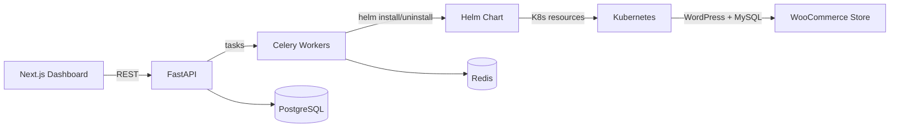
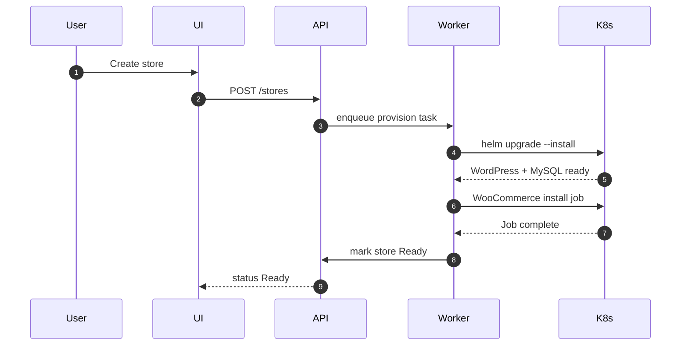

# Store Provisioning Platform

Provision isolated WooCommerce stores on Kubernetes with a FastAPI backend, Celery workers, Helm charts, and a Next.js dashboard.

## Live Demo

- **Frontend UI**: https://frontend-henna-mu-66.vercel.app/
- **Backend**: Deployed on Google Kubernetes Engine (GKE)

## What This Project Does

- Create, provision, and delete WooCommerce stores per tenant
- Enforce Kubernetes isolation via namespaces, RBAC, quotas, PVCs, and NetworkPolicies
- Automate WooCommerce installation, COD payment enablement, and sample product creation
- Provide a web UI for store lifecycle management

## Architecture Overview



## Provisioning Flow



## Main Components

- Backend API: `backend/`
  - FastAPI, SQLAlchemy, JWT auth
  - Store lifecycle endpoints
  - Quotas and rate limiting
- Background Workers: `backend/app/tasks/`
  - Celery + Redis
  - Provision and deletion tasks
- Helm Chart: `helm/woocommerce-store/`
  - WordPress + MySQL
  - RBAC, quotas, PVCs, NetworkPolicies
  - WooCommerce post-install job
- Frontend: `frontend/`
  - Next.js dashboard for store management

## Quick Start

### 1) Requirements

- Python 3.12
- Node.js + npm
- Redis
- PostgreSQL
- Helm
- Kubernetes (GKE / k3d / k3s)

### 2) Backend + Workers

```bash
bash scripts/start-all.sh
```

### 3) Frontend

```bash
START_FRONTEND=1 bash scripts/start-all.sh
```

## API Surface (Core)

- `POST /auth/register`
- `POST /auth/login`
- `POST /stores`
- `GET /stores`
- `GET /stores/{store_id}`
- `DELETE /stores/{store_id}`

## Status Model

Stores transition through:

- Pending → Provisioning → Ready
- Pending → Error
- Deleting → (removed)

## Operational Notes

- Helm chart path is resolved to an absolute path before install
- WooCommerce install job uses internal service URL for REST calls
- COD is enabled and sample products are seeded

## Useful Commands

```bash
# Tail logs
tail -f /tmp/urumi/uvicorn.log
tail -f /tmp/urumi/celery.log

# Check tenant namespace
kubectl get ns | grep store-
kubectl get pods -n <store-namespace>
```

## Directory Index

- `backend/` FastAPI API, Celery tasks, DB models
- `frontend/` Next.js dashboard
- `helm/` Helm chart for tenant infrastructure
- `scripts/` helper scripts (start/cleanup)
- `documentation.md` project notes

## Screenshots

If you want, I can add screenshots here once you provide them.
