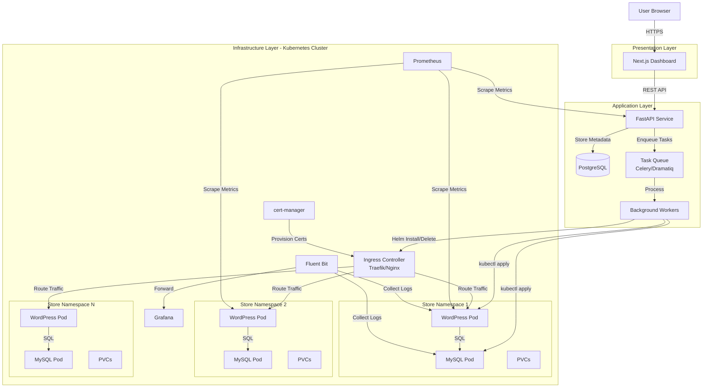

# Design Document: Store Provisioning Platform

## Overview

The Store Provisioning Platform is a multi-tenant SaaS system that automates the deployment and management of isolated WooCommerce stores on Kubernetes. The architecture follows a three-tier model:

1. **Presentation Layer**: Next.js frontend providing user dashboard and store management UI
2. **Application Layer**: FastAPI backend orchestrating store lifecycle and Kubernetes operations
3. **Infrastructure Layer**: Kubernetes cluster (k3s) hosting isolated store instances

### Key Design Principles

- **Tenant Isolation**: Each store runs in a dedicated Kubernetes namespace with network policies, resource quotas, and RBAC
- **Declarative Infrastructure**: All Kubernetes resources defined via Helm charts for consistency and repeatability
- **Asynchronous Operations**: Long-running Helm operations execute in background tasks to maintain API responsiveness
- **Idempotency**: All operations are designed to be safely retried without side effects
- **Security by Default**: Non-root containers, Pod Security Admission, network policies, and secrets management
- **Observability**: Comprehensive metrics, logging, and health monitoring at all layers

### Technology Stack

- **Frontend**: Next.js 14+ (React, TypeScript), TailwindCSS
- **Backend**: FastAPI (Python 3.11+), SQLAlchemy, Celery/Dramatiq for background tasks
- **Databases**: PostgreSQL (platform metadata), MySQL 8.0 (per-store WooCommerce data)
- **Container Orchestration**: Kubernetes (k3s), Helm 3
- **Ingress**: Traefik or Nginx Ingress Controller
- **Certificate Management**: cert-manager with Let's Encrypt
- **Monitoring**: Prometheus, Grafana
- **Logging**: Fluent Bit, Loki or Elasticsearch
- **Container Registry**: Docker Hub or private registry


## Architecture

### System Architecture Diagram



### Multi-Tenancy Model

**Tenant-Per-Namespace Isolation**:
- Each store gets a dedicated Kubernetes namespace (e.g., `store-{uuid}`)
- Namespace contains all resources for one store: WordPress, MySQL, Services, Ingress, Secrets, PVCs
- NetworkPolicies enforce default-deny with intra-namespace-only communication
- ResourceQuotas limit CPU, memory, and storage per namespace
- RBAC restricts service accounts to namespace-scoped operations only

**Isolation Guarantees**:
- **Network**: NetworkPolicies prevent cross-namespace traffic
- **Compute**: ResourceQuotas prevent resource exhaustion
- **Storage**: PVCs are namespace-scoped and isolated
- **Secrets**: Kubernetes Secrets are namespace-scoped
- **RBAC**: ServiceAccounts have no cross-namespace permissions

### Request Flow

**Store Creation Flow**:
1. User submits create store form in Next.js dashboard
2. Dashboard sends POST /stores to FastAPI with store name and domain
3. FastAPI validates input, checks user quota, creates store record (status: Pending)
4. FastAPI enqueues background task and returns 202 Accepted with store ID
5. Background worker picks up task
6. Worker generates namespace name, credentials, and Helm values
7. Worker executes `helm install` with custom values.yaml
8. Helm creates namespace, ResourceQuota, LimitRange, NetworkPolicies, RBAC, Secrets, PVCs, Deployments, Services, Ingress
9. cert-manager detects Ingress TLS annotation and requests Let's Encrypt certificate
10. Worker polls Kubernetes for pod readiness
11. When WordPress and MySQL pods are ready, worker updates store status to "Ready"
12. Dashboard polls API and displays store URL and credentials to user

**Store Access Flow**:
1. Customer navigates to store domain (e.g., store1.example.com)
2. DNS resolves to Ingress Controller LoadBalancer IP
3. Ingress Controller terminates TLS using cert-manager certificate
4. Ingress routes request to WordPress Service in store namespace
5. Service load-balances to WordPress pod(s)
6. WordPress connects to MySQL Service in same namespace
7. Response flows back through Ingress to customer


## Components and Interfaces

### 1. Next.js Dashboard (Frontend)

**Responsibilities**:
- Render user interface for store management
- Handle user authentication (JWT tokens)
- Make API calls to FastAPI backend
- Poll for store status updates
- Display store information and credentials

**Key Pages/Components**:

**StoreListPage**:
```typescript
interface Store {
  id: string;
  name: string;
  domain: string;
  status: 'Pending' | 'Ready' | 'Error' | 'Deleting';
  createdAt: string;
  url?: string;
}

// Fetches stores from GET /stores
// Displays table with store info and status badges
// Polls every 5s for stores in Pending status
```

**CreateStoreForm**:
```typescript
interface CreateStoreRequest {
  name: string;      // Alphanumeric + hyphens, 3-63 chars
  domain: string;    // Valid DNS hostname
}

// Validates input client-side
// Submits POST /stores
// Handles quota errors and validation errors
```

**StoreDetailsModal**:
```typescript
interface StoreDetails extends Store {
  adminUrl: string;
  adminUsername: string;
  adminPassword: string;
}

// Fetches GET /stores/{id}
// Displays credentials with copy-to-clipboard
// Shows security warning to change password
```

**API Client**:
```typescript
class APIClient {
  baseURL: string;
  token: string;
  
  async createStore(data: CreateStoreRequest): Promise<Store>;
  async listStores(): Promise<Store[]>;
  async getStore(id: string): Promise<StoreDetails>;
  async deleteStore(id: string): Promise<void>;
  async getStoreHealth(id: string): Promise<HealthStatus>;
}
```

**Authentication**:
- JWT token stored in httpOnly cookie or localStorage
- Token included in Authorization header for all API requests
- Token refresh logic for expired tokens

### 2. FastAPI Backend (Provisioning Service)

**Responsibilities**:
- Expose REST API for store management
- Authenticate and authorize users
- Enforce quotas and rate limits
- Orchestrate Kubernetes operations via Helm
- Manage background task queue
- Persist store metadata to PostgreSQL

**API Endpoints**:

**POST /stores**:
```python
class CreateStoreRequest(BaseModel):
    name: str = Field(min_length=3, max_length=63, pattern=r'^[a-z0-9-]+$')
    domain: str = Field(pattern=r'^[a-z0-9.-]+\.[a-z]{2,}$')

class StoreResponse(BaseModel):
    id: UUID
    name: str
    domain: str
    status: StoreStatus
    created_at: datetime
    url: Optional[str] = None

@app.post("/stores", status_code=202)
async def create_store(
    request: CreateStoreRequest,
    user: User = Depends(get_current_user),
    db: Session = Depends(get_db)
) -> StoreResponse:
    # Check user quota
    # Check rate limit
    # Validate domain uniqueness
    # Create store record (status: Pending)
    # Enqueue background task
    # Return store info
```

**GET /stores**:
```python
@app.get("/stores")
async def list_stores(
    user: User = Depends(get_current_user),
    db: Session = Depends(get_db)
) -> List[StoreResponse]:
    # Query stores for current user
    # Return list
```

**GET /stores/{id}**:
```python
class StoreDetailsResponse(StoreResponse):
    admin_url: str
    admin_username: str
    admin_password: str

@app.get("/stores/{id}")
async def get_store(
    id: UUID,
    user: User = Depends(get_current_user),
    db: Session = Depends(get_db)
) -> StoreDetailsResponse:
    # Verify ownership
    # Return store details with credentials
```

**DELETE /stores/{id}**:
```python
@app.delete("/stores/{id}", status_code=202)
async def delete_store(
    id: UUID,
    user: User = Depends(get_current_user),
    db: Session = Depends(get_db)
):
    # Verify ownership
    # Update status to Deleting
    # Enqueue deletion task
    # Return 202 Accepted
```

**GET /stores/{id}/health**:
```python
class HealthStatus(BaseModel):
    healthy: bool
    wordpress_ready: bool
    mysql_ready: bool
    details: Optional[str] = None

@app.get("/stores/{id}/health")
async def get_store_health(
    id: UUID,
    user: User = Depends(get_current_user),
    db: Session = Depends(get_db),
    k8s_client: K8sClient = Depends(get_k8s_client)
) -> HealthStatus:
    # Verify ownership
    # Query Kubernetes for pod status
    # Return health info
```

**Middleware**:
- JWT authentication middleware
- Rate limiting middleware (per-user, per-endpoint)
- Request logging middleware
- Error handling middleware
- CORS middleware for Next.js frontend

**Background Task Processing**:
```python
# Using Celery or Dramatiq
@task(max_retries=3, retry_backoff=True)
def provision_store_task(store_id: UUID):
    # Load store from database
    # Generate namespace name: f"store-{store_id}"
    # Generate random DB credentials
    # Generate WordPress salts
    # Create Helm values.yaml
    # Execute: helm install {release_name} ./woocommerce-store --values values.yaml
    # Poll for pod readiness (timeout: 10 minutes)
    # Update store status to Ready or Error
    # Store admin credentials in database

@task(max_retries=3, retry_backoff=True)
def delete_store_task(store_id: UUID):
    # Load store from database
    # Execute: helm uninstall {release_name}
    # Wait for namespace deletion
    # Delete store record from database
```

**Kubernetes Client**:
```python
class K8sClient:
    def __init__(self, kubeconfig_path: str):
        # Initialize kubernetes-python client
        
    def get_pod_status(self, namespace: str, label_selector: str) -> List[PodStatus]:
        # Query pods in namespace
        # Return readiness status
        
    def namespace_exists(self, namespace: str) -> bool:
        # Check if namespace exists
        
    def wait_for_namespace_deletion(self, namespace: str, timeout: int):
        # Poll until namespace is deleted
```

**Helm Client**:
```python
class HelmClient:
    def install(self, release_name: str, chart_path: str, namespace: str, values: dict):
        # Execute: helm install {release_name} {chart_path} -n {namespace} -f values.yaml
        # Capture output and errors
        
    def uninstall(self, release_name: str, namespace: str):
        # Execute: helm uninstall {release_name} -n {namespace}
        
    def list_releases(self, namespace: str) -> List[Release]:
        # Execute: helm list -n {namespace}
```

### 3. PostgreSQL Database (Platform Metadata)

**Schema**:

**users table**:
```sql
CREATE TABLE users (
    id UUID PRIMARY KEY DEFAULT gen_random_uuid(),
    email VARCHAR(255) UNIQUE NOT NULL,
    hashed_password VARCHAR(255) NOT NULL,
    store_quota INTEGER DEFAULT 5,
    created_at TIMESTAMP DEFAULT NOW(),
    updated_at TIMESTAMP DEFAULT NOW()
);
```

**stores table**:
```sql
CREATE TABLE stores (
    id UUID PRIMARY KEY DEFAULT gen_random_uuid(),
    user_id UUID NOT NULL REFERENCES users(id) ON DELETE CASCADE,
    name VARCHAR(63) NOT NULL,
    domain VARCHAR(255) UNIQUE NOT NULL,
    namespace VARCHAR(63) UNIQUE NOT NULL,
    status VARCHAR(20) NOT NULL, -- Pending, Ready, Error, Deleting
    helm_release_name VARCHAR(63) NOT NULL,
    admin_username VARCHAR(255),
    admin_password VARCHAR(255),
    error_message TEXT,
    created_at TIMESTAMP DEFAULT NOW(),
    updated_at TIMESTAMP DEFAULT NOW(),
    ready_at TIMESTAMP,
    INDEX idx_user_id (user_id),
    INDEX idx_status (status)
);
```

**audit_logs table**:
```sql
CREATE TABLE audit_logs (
    id BIGSERIAL PRIMARY KEY,
    user_id UUID REFERENCES users(id) ON DELETE SET NULL,
    action VARCHAR(50) NOT NULL, -- create_store, delete_store, auth_failure, etc.
    resource_type VARCHAR(50),
    resource_id UUID,
    details JSONB,
    ip_address INET,
    created_at TIMESTAMP DEFAULT NOW(),
    INDEX idx_user_id (user_id),
    INDEX idx_action (action),
    INDEX idx_created_at (created_at)
);
```

**rate_limits table**:
```sql
CREATE TABLE rate_limits (
    id BIGSERIAL PRIMARY KEY,
    user_id UUID NOT NULL REFERENCES users(id) ON DELETE CASCADE,
    endpoint VARCHAR(100) NOT NULL,
    window_start TIMESTAMP NOT NULL,
    request_count INTEGER DEFAULT 1,
    UNIQUE(user_id, endpoint, window_start)
);
```


### 4. Helm Chart (woocommerce-store)

**Chart Structure**:
```
woocommerce-store/
├── Chart.yaml
├── values.yaml
└── templates/
    ├── namespace.yaml
    ├── resourcequota.yaml
    ├── limitrange.yaml
    ├── networkpolicy.yaml
    ├── serviceaccount.yaml
    ├── role.yaml
    ├── rolebinding.yaml
    ├── secrets.yaml
    ├── mysql-pvc.yaml
    ├── wordpress-pvc.yaml
    ├── mysql-deployment.yaml
    ├── mysql-service.yaml
    ├── wordpress-deployment.yaml
    ├── wordpress-service.yaml
    ├── ingress.yaml
    └── hpa.yaml
```

**values.yaml**:
```yaml
storeName: "my-store"
storeId: "uuid-here"
domain: "store1.example.com"

namespace:
  name: "store-uuid-here"

resourceQuota:
  cpu: "4"
  memory: "8Gi"
  storage: "100Gi"
  pods: "10"

limitRange:
  defaultCpu: "100m"
  defaultMemory: "128Mi"
  maxCpu: "2"
  maxMemory: "4Gi"

mysql:
  image: "mysql:8.0"
  rootPassword: "generated-random-password"
  database: "woocommerce"
  user: "woocommerce"
  password: "generated-random-password"
  storage: "20Gi"
  storageClass: "standard"
  resources:
    requests:
      cpu: "250m"
      memory: "512Mi"
    limits:
      cpu: "1"
      memory: "2Gi"

wordpress:
  image: "wordpress:6.4-php8.2-apache"
  storage: "30Gi"
  storageClass: "standard"
  adminUser: "admin"
  adminPassword: "generated-random-password"
  adminEmail: "admin@example.com"
  salts:
    authKey: "generated-random-salt"
    secureAuthKey: "generated-random-salt"
    loggedInKey: "generated-random-salt"
    nonceKey: "generated-random-salt"
    authSalt: "generated-random-salt"
    secureAuthSalt: "generated-random-salt"
    loggedInSalt: "generated-random-salt"
    nonceSalt: "generated-random-salt"
  resources:
    requests:
      cpu: "250m"
      memory: "512Mi"
    limits:
      cpu: "2"
      memory: "4Gi"

ingress:
  className: "traefik"  # or "nginx"
  tls:
    enabled: true
    issuer: "letsencrypt-prod"

hpa:
  enabled: true
  minReplicas: 1
  maxReplicas: 5
  targetCPUUtilizationPercentage: 70
```

**Key Templates**:

**namespace.yaml**:
```yaml
apiVersion: v1
kind: Namespace
metadata:
  name: {{ .Values.namespace.name }}
  labels:
    app.kubernetes.io/name: woocommerce-store
    app.kubernetes.io/instance: {{ .Values.storeName }}
    store-id: {{ .Values.storeId }}
```

**resourcequota.yaml**:
```yaml
apiVersion: v1
kind: ResourceQuota
metadata:
  name: store-quota
  namespace: {{ .Values.namespace.name }}
spec:
  hard:
    requests.cpu: {{ .Values.resourceQuota.cpu }}
    requests.memory: {{ .Values.resourceQuota.memory }}
    requests.storage: {{ .Values.resourceQuota.storage }}
    pods: {{ .Values.resourceQuota.pods }}
```

**networkpolicy.yaml**:
```yaml
# Default deny all ingress and egress
apiVersion: networking.k8s.io/v1
kind: NetworkPolicy
metadata:
  name: default-deny
  namespace: {{ .Values.namespace.name }}
spec:
  podSelector: {}
  policyTypes:
  - Ingress
  - Egress
---
# Allow WordPress to MySQL
apiVersion: networking.k8s.io/v1
kind: NetworkPolicy
metadata:
  name: wordpress-to-mysql
  namespace: {{ .Values.namespace.name }}
spec:
  podSelector:
    matchLabels:
      app: mysql
  policyTypes:
  - Ingress
  ingress:
  - from:
    - podSelector:
        matchLabels:
          app: wordpress
    ports:
    - protocol: TCP
      port: 3306
---
# Allow ingress to WordPress
apiVersion: networking.k8s.io/v1
kind: NetworkPolicy
metadata:
  name: ingress-to-wordpress
  namespace: {{ .Values.namespace.name }}
spec:
  podSelector:
    matchLabels:
      app: wordpress
  policyTypes:
  - Ingress
  ingress:
  - from:
    - namespaceSelector:
        matchLabels:
          name: ingress-nginx  # or traefik namespace
    ports:
    - protocol: TCP
      port: 80
---
# Allow egress for DNS and external services
apiVersion: networking.k8s.io/v1
kind: NetworkPolicy
metadata:
  name: allow-dns-egress
  namespace: {{ .Values.namespace.name }}
spec:
  podSelector: {}
  policyTypes:
  - Egress
  egress:
  - to:
    - namespaceSelector:
        matchLabels:
          name: kube-system
    ports:
    - protocol: UDP
      port: 53
  - to:
    - podSelector: {}
    ports:
    - protocol: TCP
      port: 3306
    - protocol: TCP
      port: 80
  - to:  # Allow external HTTPS for WordPress updates
    - namespaceSelector: {}
    ports:
    - protocol: TCP
      port: 443
```

**mysql-deployment.yaml**:
```yaml
apiVersion: apps/v1
kind: Deployment
metadata:
  name: mysql
  namespace: {{ .Values.namespace.name }}
spec:
  replicas: 1
  selector:
    matchLabels:
      app: mysql
  template:
    metadata:
      labels:
        app: mysql
    spec:
      serviceAccountName: store-sa
      securityContext:
        runAsUser: 999
        runAsNonRoot: true
        fsGroup: 999
      containers:
      - name: mysql
        image: {{ .Values.mysql.image }}
        env:
        - name: MYSQL_ROOT_PASSWORD
          valueFrom:
            secretKeyRef:
              name: mysql-secret
              key: root-password
        - name: MYSQL_DATABASE
          value: {{ .Values.mysql.database }}
        - name: MYSQL_USER
          valueFrom:
            secretKeyRef:
              name: mysql-secret
              key: user
        - name: MYSQL_PASSWORD
          valueFrom:
            secretKeyRef:
              name: mysql-secret
              key: password
        ports:
        - containerPort: 3306
        volumeMounts:
        - name: mysql-storage
          mountPath: /var/lib/mysql
        resources:
          {{- toYaml .Values.mysql.resources | nindent 10 }}
        livenessProbe:
          exec:
            command:
            - mysqladmin
            - ping
            - -h
            - localhost
          initialDelaySeconds: 30
          periodSeconds: 10
        readinessProbe:
          exec:
            command:
            - mysqladmin
            - ping
            - -h
            - localhost
          initialDelaySeconds: 10
          periodSeconds: 5
        securityContext:
          allowPrivilegeEscalation: false
          capabilities:
            drop:
            - ALL
      volumes:
      - name: mysql-storage
        persistentVolumeClaim:
          claimName: mysql-pvc
```

**wordpress-deployment.yaml**:
```yaml
apiVersion: apps/v1
kind: Deployment
metadata:
  name: wordpress
  namespace: {{ .Values.namespace.name }}
spec:
  replicas: 1
  selector:
    matchLabels:
      app: wordpress
  template:
    metadata:
      labels:
        app: wordpress
    spec:
      serviceAccountName: store-sa
      securityContext:
        runAsUser: 1000
        runAsNonRoot: true
        fsGroup: 1000
      containers:
      - name: wordpress
        image: {{ .Values.wordpress.image }}
        env:
        - name: WORDPRESS_DB_HOST
          value: mysql:3306
        - name: WORDPRESS_DB_NAME
          value: {{ .Values.mysql.database }}
        - name: WORDPRESS_DB_USER
          valueFrom:
            secretKeyRef:
              name: mysql-secret
              key: user
        - name: WORDPRESS_DB_PASSWORD
          valueFrom:
            secretKeyRef:
              name: mysql-secret
              key: password
        - name: WORDPRESS_AUTH_KEY
          valueFrom:
            secretKeyRef:
              name: wordpress-secret
              key: auth-key
        - name: WORDPRESS_SECURE_AUTH_KEY
          valueFrom:
            secretKeyRef:
              name: wordpress-secret
              key: secure-auth-key
        # ... other salts
        ports:
        - containerPort: 80
        volumeMounts:
        - name: wordpress-storage
          mountPath: /var/www/html/wp-content/uploads
        resources:
          {{- toYaml .Values.wordpress.resources | nindent 10 }}
        livenessProbe:
          httpGet:
            path: /wp-admin/install.php
            port: 80
          initialDelaySeconds: 60
          periodSeconds: 10
        readinessProbe:
          httpGet:
            path: /wp-admin/install.php
            port: 80
          initialDelaySeconds: 30
          periodSeconds: 5
        securityContext:
          allowPrivilegeEscalation: false
          capabilities:
            drop:
            - ALL
      volumes:
      - name: wordpress-storage
        persistentVolumeClaim:
          claimName: wordpress-pvc
```

**ingress.yaml**:
```yaml
apiVersion: networking.k8s.io/v1
kind: Ingress
metadata:
  name: wordpress-ingress
  namespace: {{ .Values.namespace.name }}
  annotations:
    cert-manager.io/cluster-issuer: {{ .Values.ingress.tls.issuer }}
    {{- if eq .Values.ingress.className "nginx" }}
    nginx.ingress.kubernetes.io/ssl-redirect: "true"
    {{- else if eq .Values.ingress.className "traefik" }}
    traefik.ingress.kubernetes.io/redirect-entry-point: https
    {{- end }}
spec:
  ingressClassName: {{ .Values.ingress.className }}
  tls:
  - hosts:
    - {{ .Values.domain }}
    secretName: {{ .Values.storeName }}-tls
  rules:
  - host: {{ .Values.domain }}
    http:
      paths:
      - path: /
        pathType: Prefix
        backend:
          service:
            name: wordpress
            port:
              number: 80
```

### 5. Kubernetes Cluster Components

**Ingress Controller (Traefik or Nginx)**:
- Deployed in dedicated namespace (e.g., `ingress-nginx` or `traefik`)
- LoadBalancer service exposing ports 80 and 443
- Routes traffic based on Ingress rules
- Terminates TLS using certificates from cert-manager

**cert-manager**:
- Deployed in `cert-manager` namespace
- ClusterIssuer for Let's Encrypt production:
```yaml
apiVersion: cert-manager.io/v1
kind: ClusterIssuer
metadata:
  name: letsencrypt-prod
spec:
  acme:
    server: https://acme-v02.api.letsencrypt.org/directory
    email: admin@example.com
    privateKeySecretRef:
      name: letsencrypt-prod
    solvers:
    - http01:
        ingress:
          class: traefik  # or nginx
```

**Prometheus**:
- Scrapes metrics from FastAPI service
- Scrapes metrics from Kubernetes API (cAdvisor)
- ServiceMonitor for per-namespace pod metrics
- Stores metrics with namespace labels

**Fluent Bit**:
- DaemonSet on all nodes
- Collects container logs
- Enriches with namespace and pod metadata
- Forwards to Loki or Elasticsearch

**Grafana**:
- Pre-configured dashboards for:
  - Per-namespace resource usage (CPU, memory, storage)
  - Pod health status
  - FastAPI request metrics
  - Store provisioning metrics


## Data Models

### FastAPI Models (Pydantic)

**User Model**:
```python
from pydantic import BaseModel, EmailStr, UUID4
from datetime import datetime

class User(BaseModel):
    id: UUID4
    email: EmailStr
    store_quota: int = 5
    created_at: datetime
    updated_at: datetime
    
    class Config:
        from_attributes = True
```

**Store Model**:
```python
from enum import Enum

class StoreStatus(str, Enum):
    PENDING = "Pending"
    READY = "Ready"
    ERROR = "Error"
    DELETING = "Deleting"

class Store(BaseModel):
    id: UUID4
    user_id: UUID4
    name: str
    domain: str
    namespace: str
    status: StoreStatus
    helm_release_name: str
    admin_username: Optional[str] = None
    admin_password: Optional[str] = None
    error_message: Optional[str] = None
    created_at: datetime
    updated_at: datetime
    ready_at: Optional[datetime] = None
    
    class Config:
        from_attributes = True
```

**Request/Response Models**:
```python
class CreateStoreRequest(BaseModel):
    name: str = Field(
        min_length=3,
        max_length=63,
        pattern=r'^[a-z0-9-]+$',
        description="Store name (alphanumeric and hyphens only)"
    )
    domain: str = Field(
        pattern=r'^[a-z0-9.-]+\.[a-z]{2,}$',
        description="Fully qualified domain name"
    )

class StoreResponse(BaseModel):
    id: UUID4
    name: str
    domain: str
    status: StoreStatus
    created_at: datetime
    url: Optional[str] = None
    
    @validator('url', always=True)
    def set_url(cls, v, values):
        if values.get('status') == StoreStatus.READY:
            return f"https://{values['domain']}"
        return None

class StoreDetailsResponse(StoreResponse):
    admin_url: str
    admin_username: str
    admin_password: str
    
    @validator('admin_url', always=True)
    def set_admin_url(cls, v, values):
        return f"https://{values['domain']}/wp-admin"

class HealthStatus(BaseModel):
    healthy: bool
    wordpress_ready: bool
    mysql_ready: bool
    details: Optional[str] = None

class ErrorResponse(BaseModel):
    error: str
    detail: Optional[str] = None
    field_errors: Optional[Dict[str, List[str]]] = None
```

**Audit Log Model**:
```python
class AuditLog(BaseModel):
    id: int
    user_id: Optional[UUID4]
    action: str
    resource_type: Optional[str]
    resource_id: Optional[UUID4]
    details: Optional[Dict[str, Any]]
    ip_address: Optional[str]
    created_at: datetime
```

### SQLAlchemy ORM Models

```python
from sqlalchemy import Column, String, Integer, DateTime, Text, ForeignKey, Index
from sqlalchemy.dialects.postgresql import UUID, JSONB, INET
from sqlalchemy.orm import relationship
import uuid

class UserORM(Base):
    __tablename__ = "users"
    
    id = Column(UUID(as_uuid=True), primary_key=True, default=uuid.uuid4)
    email = Column(String(255), unique=True, nullable=False)
    hashed_password = Column(String(255), nullable=False)
    store_quota = Column(Integer, default=5)
    created_at = Column(DateTime, server_default=func.now())
    updated_at = Column(DateTime, server_default=func.now(), onupdate=func.now())
    
    stores = relationship("StoreORM", back_populates="user", cascade="all, delete-orphan")

class StoreORM(Base):
    __tablename__ = "stores"
    
    id = Column(UUID(as_uuid=True), primary_key=True, default=uuid.uuid4)
    user_id = Column(UUID(as_uuid=True), ForeignKey("users.id", ondelete="CASCADE"), nullable=False)
    name = Column(String(63), nullable=False)
    domain = Column(String(255), unique=True, nullable=False)
    namespace = Column(String(63), unique=True, nullable=False)
    status = Column(String(20), nullable=False)
    helm_release_name = Column(String(63), nullable=False)
    admin_username = Column(String(255))
    admin_password = Column(String(255))
    error_message = Column(Text)
    created_at = Column(DateTime, server_default=func.now())
    updated_at = Column(DateTime, server_default=func.now(), onupdate=func.now())
    ready_at = Column(DateTime)
    
    user = relationship("UserORM", back_populates="stores")
    
    __table_args__ = (
        Index('idx_user_id', 'user_id'),
        Index('idx_status', 'status'),
    )

class AuditLogORM(Base):
    __tablename__ = "audit_logs"
    
    id = Column(Integer, primary_key=True, autoincrement=True)
    user_id = Column(UUID(as_uuid=True), ForeignKey("users.id", ondelete="SET NULL"))
    action = Column(String(50), nullable=False)
    resource_type = Column(String(50))
    resource_id = Column(UUID(as_uuid=True))
    details = Column(JSONB)
    ip_address = Column(INET)
    created_at = Column(DateTime, server_default=func.now())
    
    __table_args__ = (
        Index('idx_user_id', 'user_id'),
        Index('idx_action', 'action'),
        Index('idx_created_at', 'created_at'),
    )

class RateLimitORM(Base):
    __tablename__ = "rate_limits"
    
    id = Column(Integer, primary_key=True, autoincrement=True)
    user_id = Column(UUID(as_uuid=True), ForeignKey("users.id", ondelete="CASCADE"), nullable=False)
    endpoint = Column(String(100), nullable=False)
    window_start = Column(DateTime, nullable=False)
    request_count = Column(Integer, default=1)
    
    __table_args__ = (
        UniqueConstraint('user_id', 'endpoint', 'window_start'),
    )
```

### Next.js TypeScript Interfaces

```typescript
// types/store.ts
export enum StoreStatus {
  Pending = 'Pending',
  Ready = 'Ready',
  Error = 'Error',
  Deleting = 'Deleting'
}

export interface Store {
  id: string;
  name: string;
  domain: string;
  status: StoreStatus;
  createdAt: string;
  url?: string;
}

export interface StoreDetails extends Store {
  adminUrl: string;
  adminUsername: string;
  adminPassword: string;
}

export interface CreateStoreRequest {
  name: string;
  domain: string;
}

export interface HealthStatus {
  healthy: boolean;
  wordpressReady: boolean;
  mysqlReady: boolean;
  details?: string;
}

export interface APIError {
  error: string;
  detail?: string;
  fieldErrors?: Record<string, string[]>;
}
```

### Helm Values Structure

```yaml
# Generated dynamically by FastAPI for each store
storeName: string          # User-provided store name
storeId: string           # UUID
domain: string            # User-provided domain

namespace:
  name: string            # "store-{uuid}"

resourceQuota:
  cpu: string             # "4"
  memory: string          # "8Gi"
  storage: string         # "100Gi"
  pods: string            # "10"

limitRange:
  defaultCpu: string      # "100m"
  defaultMemory: string   # "128Mi"
  maxCpu: string          # "2"
  maxMemory: string       # "4Gi"

mysql:
  image: string           # "mysql:8.0"
  rootPassword: string    # Generated random 32-char string
  database: string        # "woocommerce"
  user: string            # "woocommerce"
  password: string        # Generated random 32-char string
  storage: string         # "20Gi"
  storageClass: string    # "standard"
  resources:
    requests:
      cpu: string         # "250m"
      memory: string      # "512Mi"
    limits:
      cpu: string         # "1"
      memory: string      # "2Gi"

wordpress:
  image: string           # "wordpress:6.4-php8.2-apache"
  storage: string         # "30Gi"
  storageClass: string    # "standard"
  adminUser: string       # "admin"
  adminPassword: string   # Generated random 32-char string
  adminEmail: string      # User email or default
  salts:
    authKey: string       # Generated random 64-char string
    secureAuthKey: string
    loggedInKey: string
    nonceKey: string
    authSalt: string
    secureAuthSalt: string
    loggedInSalt: string
    nonceSalt: string
  resources:
    requests:
      cpu: string         # "250m"
      memory: string      # "512Mi"
    limits:
      cpu: string         # "2"
      memory: string      # "4Gi"

ingress:
  className: string       # "traefik" or "nginx"
  tls:
    enabled: bool         # true
    issuer: string        # "letsencrypt-prod"

hpa:
  enabled: bool           # true
  minReplicas: int        # 1
  maxReplicas: int        # 5
  targetCPUUtilizationPercentage: int  # 70
```


## Correctness Properties

*A property is a characteristic or behavior that should hold true across all valid executions of a system—essentially, a formal statement about what the system should do. Properties serve as the bridge between human-readable specifications and machine-verifiable correctness guarantees.*

### Property 1: Store Creation Idempotency
*For any* store creation request with the same store identifier, submitting the request multiple times should either return the existing store or update it without creating duplicates.
**Validates: Requirements 1.6, 27.1, 27.2**

### Property 2: Store Status Transitions
*For any* store, the status transitions should follow the valid state machine: Pending → Ready/Error, or any status → Deleting → (deleted).
**Validates: Requirements 1.1, 1.7, 1.8, 5.1**

### Property 3: Namespace Isolation
*For any* two different stores, network traffic between their namespaces should be blocked by NetworkPolicies.
**Validates: Requirements 2.10, 15.4**

### Property 4: Resource Quota Enforcement
*For any* store namespace, the total resource usage (CPU, memory, storage) should never exceed the ResourceQuota limits.
**Validates: Requirements 2.2, 2.3**

### Property 5: Store Ownership Authorization
*For any* store operation (retrieve, delete, health check), a user should only be able to access stores they own.
**Validates: Requirements 4.4, 5.7, 7.3**

### Property 6: User Quota Enforcement
*For any* user, the number of active stores should never exceed their quota limit.
**Validates: Requirements 8.1, 8.2, 8.3, 8.4**

### Property 7: Rate Limiting
*For any* user making store creation requests, requests exceeding 1 per minute should be rejected with HTTP 429.
**Validates: Requirements 9.1, 9.2, 9.3**

### Property 8: Domain Uniqueness
*For any* two stores, they should never have the same domain configured.
**Validates: Requirements 17.5**

### Property 9: TLS Certificate Provisioning
*For any* store with a valid domain, a TLS certificate should be automatically provisioned and the store should be accessible over HTTPS.
**Validates: Requirements 3.2, 3.3, 30.1, 30.2, 30.3**

### Property 10: Health Check Accuracy
*For any* store, the health status should accurately reflect the readiness of WordPress and MySQL pods.
**Validates: Requirements 6.2, 6.3, 6.4**

### Property 11: Secrets Never Logged
*For any* operation involving secrets (database passwords, WordPress salts), the secret values should never appear in logs.
**Validates: Requirements 16.5**

### Property 12: Input Validation Rejection
*For any* invalid input (malformed store name, invalid domain format), the API should reject the request with HTTP 422 and detailed error messages.
**Validates: Requirements 17.1, 17.2, 17.3, 17.4**

### Property 13: Audit Log Completeness
*For any* store creation or deletion operation, an audit log entry should be created with user identity, store identifier, and timestamp.
**Validates: Requirements 18.1, 18.2**

### Property 14: Background Task Retry
*For any* failed background task, the system should retry up to 3 times with exponential backoff before marking as Error.
**Validates: Requirements 23.4, 23.5**

### Property 15: Database Persistence
*For any* store operation, the store metadata should be persisted to PostgreSQL and survive service restarts.
**Validates: Requirements 24.1, 24.2, 24.3, 24.4**

### Property 16: Container Security Configuration
*For any* deployed container (WordPress or MySQL), it should run as non-root user with privilege escalation disabled and minimal capabilities.
**Validates: Requirements 14.1, 14.2, 14.5, 14.6**

### Property 17: Network Policy Intra-Namespace Communication
*For any* store namespace, WordPress pods should be able to communicate with MySQL pods within the same namespace.
**Validates: Requirements 15.2**

### Property 18: Ingress Traffic Routing
*For any* store in Ready status, HTTP requests to the store domain should be routed to the WordPress service and redirected to HTTPS.
**Validates: Requirements 3.5, 15.3**

### Property 19: Health Probe Restart
*For any* pod with failing health probes, Kubernetes should automatically restart the unhealthy container.
**Validates: Requirements 21.5**

### Property 20: Helm Chart Consistency
*For any* store deployment using the Helm chart, all required Kubernetes resources (Namespace, ResourceQuota, NetworkPolicy, RBAC, Secrets, PVCs, Deployments, Services, Ingress) should be created.
**Validates: Requirements 22.1, 22.2, 22.3, 22.4, 22.5, 22.6, 22.7, 22.8, 22.9**

### Property 21: Horizontal Pod Autoscaling
*For any* store with HPA enabled, when CPU usage exceeds 70%, WordPress pod replicas should increase (up to max 5), and when CPU drops below 30%, replicas should decrease (down to min 1).
**Validates: Requirements 26.2, 26.3, 26.4**

### Property 22: Credentials Generation Uniqueness
*For any* two stores, the generated database credentials and WordPress salts should be unique and randomly generated.
**Validates: Requirements 16.1, 16.2**

### Property 23: Metrics Collection
*For any* store provisioning operation, Prometheus metrics should be exposed for provisioning duration, success/failure counts, and API request latency.
**Validates: Requirements 19.1, 19.2, 19.3**

### Property 24: Log Aggregation with Metadata
*For any* container log entry, it should be enriched with namespace and store identifier metadata for filtering.
**Validates: Requirements 20.2, 20.4**

### Property 25: Store Deletion Cleanup
*For any* deleted store, all Kubernetes resources in the namespace should be removed, the namespace should be deleted, and the database record should be removed.
**Validates: Requirements 5.3, 5.4, 5.5, 5.6**

### Property 26: Authentication Token Validation
*For any* API request, if the JWT token is invalid or expired, the request should be rejected with HTTP 401.
**Validates: Requirements 7.1, 7.2, 7.5**

### Property 27: Error Response Structure
*For any* API error, the response should include a structured error message with error code and detail.
**Validates: Requirements 28.1, 28.2**

### Property 28: Dashboard Real-Time Updates
*For any* store in Pending status, the dashboard should poll the API every 5 seconds and stop polling when status changes to Ready or Error.
**Validates: Requirements 12.1, 12.2, 12.3**

### Property 29: Certificate Auto-Renewal
*For any* TLS certificate approaching expiration, cert-manager should automatically renew it before expiration.
**Validates: Requirements 30.4**

### Property 30: Declarative Resource Application
*For any* Kubernetes resource creation, using declarative apply operations should be idempotent and not fail if resources already exist.
**Validates: Requirements 27.3, 27.4**


## Error Handling

### API Error Responses

**Validation Errors (HTTP 422)**:
```python
{
  "error": "Validation Error",
  "detail": "Invalid input data",
  "field_errors": {
    "name": ["Store name must be 3-63 characters", "Only alphanumeric and hyphens allowed"],
    "domain": ["Invalid domain format"]
  }
}
```

**Authentication Errors (HTTP 401)**:
```python
{
  "error": "Unauthorized",
  "detail": "Invalid or expired token"
}
```

**Authorization Errors (HTTP 403)**:
```python
{
  "error": "Forbidden",
  "detail": "You do not have permission to access this store"
}
```

**Not Found Errors (HTTP 404)**:
```python
{
  "error": "Not Found",
  "detail": "Store with ID {id} not found"
}
```

**Quota Exceeded (HTTP 429)**:
```python
{
  "error": "Quota Exceeded",
  "detail": "You have reached your store limit of 5 stores"
}
```

**Rate Limit Exceeded (HTTP 429)**:
```python
{
  "error": "Rate Limit Exceeded",
  "detail": "Too many requests. Please try again in 60 seconds",
  "retry_after": 60
}
```

**Server Errors (HTTP 500)**:
```python
{
  "error": "Internal Server Error",
  "detail": "An unexpected error occurred. Please try again later",
  "request_id": "uuid-for-tracking"
}
```

### Background Task Error Handling

**Helm Installation Failures**:
- Capture stderr from helm install command
- Parse error messages for common issues:
  - Insufficient cluster resources → "Cluster capacity exceeded"
  - Invalid values → "Invalid Helm values provided"
  - Timeout → "Deployment timeout after 10 minutes"
- Update store status to "Error" with error_message field
- Log full error details with stack trace
- Retry up to 3 times with exponential backoff (1min, 2min, 4min)

**Kubernetes API Failures**:
- Handle connection errors → Retry with backoff
- Handle authentication errors → Log and alert operator
- Handle resource conflicts → Use declarative apply for idempotency
- Handle quota exceeded → Update store status to "Error" with clear message

**Database Failures**:
- Connection pool exhaustion → Retry with backoff
- Deadlocks → Retry transaction
- Constraint violations → Return 409 Conflict with details
- Connection loss → Reconnect and retry

**Certificate Provisioning Failures**:
- ACME challenge failures → Log details, cert-manager will retry
- DNS propagation delays → Wait and retry
- Rate limit from Let's Encrypt → Log and alert operator
- Invalid domain → Update store status to "Error"

### Dashboard Error Handling

**Network Errors**:
- Display user-friendly message: "Unable to connect to server. Please check your internet connection."
- Implement exponential backoff retry (1s, 2s, 4s, 8s, max 30s)
- Show retry button for manual retry

**API Errors**:
- Parse error response and display specific message
- For validation errors, highlight specific form fields
- For quota errors, display upgrade prompt or delete store option
- For auth errors, redirect to login page

**Polling Errors**:
- If polling fails 3 times consecutively, stop polling and show error
- Provide manual refresh button
- Log errors to browser console for debugging

### Logging Strategy

**Structured Logging Format**:
```python
{
  "timestamp": "2024-01-15T10:30:00Z",
  "level": "ERROR",
  "service": "provisioning-service",
  "request_id": "uuid",
  "user_id": "uuid",
  "store_id": "uuid",
  "action": "helm_install",
  "message": "Helm installation failed",
  "error": "timeout waiting for pods",
  "stack_trace": "...",
  "metadata": {
    "namespace": "store-uuid",
    "helm_release": "store-name"
  }
}
```

**Log Levels**:
- **DEBUG**: Detailed diagnostic information (disabled in production)
- **INFO**: General informational messages (store created, status changed)
- **WARNING**: Unexpected but handled situations (retry attempts, slow operations)
- **ERROR**: Error conditions that need attention (failed deployments, API errors)
- **CRITICAL**: System-level failures requiring immediate action (database down, cluster unreachable)

**Sensitive Data Redaction**:
- Never log passwords, tokens, or secret values
- Redact email addresses in non-audit logs
- Mask IP addresses in compliance with privacy regulations
- Use placeholders: `password=***REDACTED***`

### Monitoring and Alerting

**Critical Alerts** (Page operator immediately):
- Provisioning service down
- Database connection failures
- Kubernetes API unreachable
- Certificate provisioning failures for >1 hour
- Disk space >90% on any node

**Warning Alerts** (Notify during business hours):
- High error rate (>5% of requests)
- Slow API response times (p95 >2s)
- Background task queue backlog >100
- Failed store provisioning >3 in 1 hour
- Certificate expiring in <7 days

**Metrics to Monitor**:
- Store provisioning success rate
- Store provisioning duration (p50, p95, p99)
- API request latency per endpoint
- Background task queue depth
- Database connection pool usage
- Per-namespace CPU and memory usage
- Pod restart counts
- Certificate expiration dates


## Testing Strategy

### Dual Testing Approach

The testing strategy employs both **unit tests** and **property-based tests** to ensure comprehensive coverage:

- **Unit tests**: Verify specific examples, edge cases, error conditions, and integration points
- **Property tests**: Verify universal properties across all inputs through randomization
- Both approaches are complementary and necessary for comprehensive correctness validation

### Property-Based Testing Configuration

**Library Selection**:
- **Python (FastAPI)**: Use `hypothesis` library for property-based testing
- **TypeScript (Next.js)**: Use `fast-check` library for property-based testing

**Test Configuration**:
- Minimum 100 iterations per property test (due to randomization)
- Each property test must reference its design document property
- Tag format: `# Feature: store-provisioning-platform, Property {number}: {property_text}`

**Example Property Test Structure**:
```python
from hypothesis import given, strategies as st
import pytest

# Feature: store-provisioning-platform, Property 1: Store Creation Idempotency
@given(
    store_id=st.uuids(),
    store_name=st.text(min_size=3, max_size=63, alphabet=st.characters(whitelist_categories=('Ll', 'Nd'), whitelist_characters='-')),
    domain=st.from_regex(r'^[a-z0-9.-]+\.[a-z]{2,}$', fullmatch=True)
)
@pytest.mark.property_test
def test_store_creation_idempotency(store_id, store_name, domain):
    """
    For any store creation request with the same store identifier,
    submitting the request multiple times should either return the
    existing store or update it without creating duplicates.
    """
    # First creation
    response1 = create_store(store_id, store_name, domain)
    
    # Second creation with same ID
    response2 = create_store(store_id, store_name, domain)
    
    # Should return same store or updated version, not create duplicate
    assert response1.id == response2.id
    assert get_store_count_by_id(store_id) == 1
```

### Unit Testing Strategy

**FastAPI Backend Tests**:

**API Endpoint Tests**:
```python
# Test specific examples
def test_create_store_success():
    """Test successful store creation with valid input"""
    response = client.post("/stores", json={
        "name": "test-store",
        "domain": "test.example.com"
    }, headers=auth_headers)
    assert response.status_code == 202
    assert response.json()["status"] == "Pending"

def test_create_store_invalid_name():
    """Test store creation with invalid name format"""
    response = client.post("/stores", json={
        "name": "Test Store!",  # Invalid characters
        "domain": "test.example.com"
    }, headers=auth_headers)
    assert response.status_code == 422
    assert "name" in response.json()["field_errors"]

def test_create_store_quota_exceeded():
    """Test store creation when user quota is exceeded"""
    # Create 5 stores (quota limit)
    for i in range(5):
        create_store(f"store-{i}", f"store{i}.example.com")
    
    # Attempt to create 6th store
    response = client.post("/stores", json={
        "name": "store-6",
        "domain": "store6.example.com"
    }, headers=auth_headers)
    assert response.status_code == 429
    assert "quota" in response.json()["detail"].lower()

def test_get_store_unauthorized():
    """Test accessing another user's store"""
    store = create_store_for_user(user_id="other-user")
    response = client.get(f"/stores/{store.id}", headers=auth_headers)
    assert response.status_code == 403

def test_delete_store_success():
    """Test successful store deletion"""
    store = create_store("test-store", "test.example.com")
    response = client.delete(f"/stores/{store.id}", headers=auth_headers)
    assert response.status_code == 202
    
    # Verify status updated to Deleting
    store_status = get_store_status(store.id)
    assert store_status == "Deleting"
```

**Background Task Tests**:
```python
@pytest.mark.asyncio
async def test_provision_store_task_success(mock_helm, mock_k8s):
    """Test successful store provisioning task"""
    store = create_store_record("test-store", "test.example.com")
    
    # Mock successful Helm install
    mock_helm.install.return_value = {"status": "deployed"}
    mock_k8s.get_pod_status.return_value = [
        {"name": "wordpress", "ready": True},
        {"name": "mysql", "ready": True}
    ]
    
    await provision_store_task(store.id)
    
    # Verify store status updated to Ready
    updated_store = get_store(store.id)
    assert updated_store.status == "Ready"
    assert updated_store.admin_username is not None
    assert updated_store.admin_password is not None

@pytest.mark.asyncio
async def test_provision_store_task_retry_on_failure(mock_helm):
    """Test task retry logic on failure"""
    store = create_store_record("test-store", "test.example.com")
    
    # Mock Helm failure
    mock_helm.install.side_effect = HelmError("Timeout")
    
    with pytest.raises(HelmError):
        await provision_store_task(store.id)
    
    # Verify task was retried 3 times
    assert mock_helm.install.call_count == 3
    
    # Verify store status updated to Error
    updated_store = get_store(store.id)
    assert updated_store.status == "Error"
    assert "Timeout" in updated_store.error_message
```

**Kubernetes Client Tests**:
```python
def test_k8s_client_get_pod_status(k8s_client):
    """Test retrieving pod status from Kubernetes"""
    # Create test namespace and pods
    create_test_namespace("test-namespace")
    create_test_pod("test-namespace", "wordpress", ready=True)
    create_test_pod("test-namespace", "mysql", ready=False)
    
    status = k8s_client.get_pod_status("test-namespace", "app in (wordpress,mysql)")
    
    assert len(status) == 2
    assert status[0]["name"] == "wordpress"
    assert status[0]["ready"] is True
    assert status[1]["name"] == "mysql"
    assert status[1]["ready"] is False
```

**Database Tests**:
```python
def test_store_crud_operations(db_session):
    """Test store CRUD operations"""
    # Create
    store = StoreORM(
        user_id=uuid.uuid4(),
        name="test-store",
        domain="test.example.com",
        namespace="store-uuid",
        status="Pending",
        helm_release_name="test-store"
    )
    db_session.add(store)
    db_session.commit()
    
    # Read
    retrieved = db_session.query(StoreORM).filter_by(id=store.id).first()
    assert retrieved.name == "test-store"
    
    # Update
    retrieved.status = "Ready"
    db_session.commit()
    
    # Delete
    db_session.delete(retrieved)
    db_session.commit()
    assert db_session.query(StoreORM).filter_by(id=store.id).first() is None

def test_user_quota_enforcement(db_session):
    """Test user quota is enforced at database level"""
    user = UserORM(email="test@example.com", store_quota=2)
    db_session.add(user)
    db_session.commit()
    
    # Create 2 stores (at quota)
    for i in range(2):
        store = StoreORM(
            user_id=user.id,
            name=f"store-{i}",
            domain=f"store{i}.example.com",
            namespace=f"store-{i}",
            status="Ready",
            helm_release_name=f"store-{i}"
        )
        db_session.add(store)
    db_session.commit()
    
    # Verify quota check
    store_count = db_session.query(StoreORM).filter_by(user_id=user.id).count()
    assert store_count == 2
    assert store_count >= user.store_quota
```

**Next.js Frontend Tests**:

**Component Tests (React Testing Library)**:
```typescript
import { render, screen, fireEvent, waitFor } from '@testing-library/react';
import { StoreListPage } from '@/components/StoreListPage';
import { CreateStoreForm } from '@/components/CreateStoreForm';

describe('StoreListPage', () => {
  it('displays list of stores', async () => {
    const mockStores = [
      { id: '1', name: 'store-1', domain: 'store1.example.com', status: 'Ready', createdAt: '2024-01-01' },
      { id: '2', name: 'store-2', domain: 'store2.example.com', status: 'Pending', createdAt: '2024-01-02' }
    ];
    
    mockFetch('/stores', { stores: mockStores });
    
    render(<StoreListPage />);
    
    await waitFor(() => {
      expect(screen.getByText('store-1')).toBeInTheDocument();
      expect(screen.getByText('store-2')).toBeInTheDocument();
    });
  });
  
  it('polls for status updates when store is pending', async () => {
    const mockStore = { id: '1', name: 'store-1', domain: 'store1.example.com', status: 'Pending', createdAt: '2024-01-01' };
    
    mockFetch('/stores', { stores: [mockStore] });
    
    render(<StoreListPage />);
    
    // Wait for initial render
    await waitFor(() => expect(screen.getByText('store-1')).toBeInTheDocument());
    
    // Update mock to return Ready status
    mockFetch('/stores', { stores: [{ ...mockStore, status: 'Ready' }] });
    
    // Wait for polling interval (5 seconds)
    await waitFor(() => expect(screen.getByText('Ready')).toBeInTheDocument(), { timeout: 6000 });
  });
});

describe('CreateStoreForm', () => {
  it('validates input before submission', async () => {
    render(<CreateStoreForm />);
    
    const nameInput = screen.getByLabelText('Store Name');
    const domainInput = screen.getByLabelText('Domain');
    const submitButton = screen.getByText('Create Store');
    
    // Try to submit with invalid name
    fireEvent.change(nameInput, { target: { value: 'Invalid Name!' } });
    fireEvent.change(domainInput, { target: { value: 'test.example.com' } });
    fireEvent.click(submitButton);
    
    await waitFor(() => {
      expect(screen.getByText(/only alphanumeric/i)).toBeInTheDocument();
    });
  });
  
  it('submits form with valid data', async () => {
    const mockOnSuccess = jest.fn();
    render(<CreateStoreForm onSuccess={mockOnSuccess} />);
    
    const nameInput = screen.getByLabelText('Store Name');
    const domainInput = screen.getByLabelText('Domain');
    const submitButton = screen.getByText('Create Store');
    
    fireEvent.change(nameInput, { target: { value: 'test-store' } });
    fireEvent.change(domainInput, { target: { value: 'test.example.com' } });
    
    mockFetch('/stores', { id: '1', name: 'test-store', status: 'Pending' }, { method: 'POST' });
    
    fireEvent.click(submitButton);
    
    await waitFor(() => {
      expect(mockOnSuccess).toHaveBeenCalled();
    });
  });
  
  it('displays error when quota exceeded', async () => {
    render(<CreateStoreForm />);
    
    const nameInput = screen.getByLabelText('Store Name');
    const domainInput = screen.getByLabelText('Domain');
    const submitButton = screen.getByText('Create Store');
    
    fireEvent.change(nameInput, { target: { value: 'test-store' } });
    fireEvent.change(domainInput, { target: { value: 'test.example.com' } });
    
    mockFetch('/stores', { error: 'Quota Exceeded', detail: 'You have reached your store limit' }, { method: 'POST', status: 429 });
    
    fireEvent.click(submitButton);
    
    await waitFor(() => {
      expect(screen.getByText(/quota/i)).toBeInTheDocument();
    });
  });
});
```

**Integration Tests**:

**End-to-End Store Lifecycle**:
```python
@pytest.mark.integration
def test_complete_store_lifecycle(client, db_session, k8s_cluster):
    """Test complete store lifecycle from creation to deletion"""
    # 1. Create store
    response = client.post("/stores", json={
        "name": "integration-test",
        "domain": "integration.example.com"
    }, headers=auth_headers)
    assert response.status_code == 202
    store_id = response.json()["id"]
    
    # 2. Wait for provisioning to complete
    max_wait = 600  # 10 minutes
    start_time = time.time()
    while time.time() - start_time < max_wait:
        response = client.get(f"/stores/{store_id}", headers=auth_headers)
        status = response.json()["status"]
        if status == "Ready":
            break
        elif status == "Error":
            pytest.fail(f"Store provisioning failed: {response.json()['error_message']}")
        time.sleep(10)
    else:
        pytest.fail("Store provisioning timeout")
    
    # 3. Verify Kubernetes resources exist
    namespace = f"store-{store_id}"
    assert k8s_cluster.namespace_exists(namespace)
    pods = k8s_cluster.get_pods(namespace)
    assert len(pods) == 2  # WordPress and MySQL
    assert all(pod.ready for pod in pods)
    
    # 4. Verify health check
    response = client.get(f"/stores/{store_id}/health", headers=auth_headers)
    assert response.json()["healthy"] is True
    
    # 5. Verify store is accessible via HTTP
    store_url = response.json()["url"]
    http_response = requests.get(store_url, verify=False)
    assert http_response.status_code == 200
    assert "WordPress" in http_response.text
    
    # 6. Delete store
    response = client.delete(f"/stores/{store_id}", headers=auth_headers)
    assert response.status_code == 202
    
    # 7. Wait for deletion to complete
    start_time = time.time()
    while time.time() - start_time < max_wait:
        if not k8s_cluster.namespace_exists(namespace):
            break
        time.sleep(10)
    else:
        pytest.fail("Store deletion timeout")
    
    # 8. Verify database record removed
    store = db_session.query(StoreORM).filter_by(id=store_id).first()
    assert store is None
```

**Helm Chart Tests**:
```bash
# Using helm unittest plugin
helm unittest woocommerce-store/

# Test chart rendering with different values
helm template test-release woocommerce-store/ \
  --set storeName=test \
  --set domain=test.example.com \
  --dry-run --debug

# Validate generated manifests
helm template test-release woocommerce-store/ | kubectl apply --dry-run=client -f -
```

### Test Coverage Goals

- **Unit Test Coverage**: Minimum 80% code coverage for FastAPI backend
- **Property Test Coverage**: All 30 correctness properties implemented as property tests
- **Integration Test Coverage**: Critical user flows (store creation, deletion, health checks)
- **Frontend Test Coverage**: Minimum 70% coverage for React components

### Continuous Integration

**CI Pipeline**:
1. Run linters (flake8, mypy, eslint, prettier)
2. Run unit tests with coverage reporting
3. Run property tests (100 iterations per property)
4. Run integration tests against test Kubernetes cluster
5. Build Docker images
6. Deploy to staging environment
7. Run smoke tests against staging

**Test Execution Time**:
- Unit tests: <2 minutes
- Property tests: <5 minutes
- Integration tests: <15 minutes
- Total CI pipeline: <25 minutes
